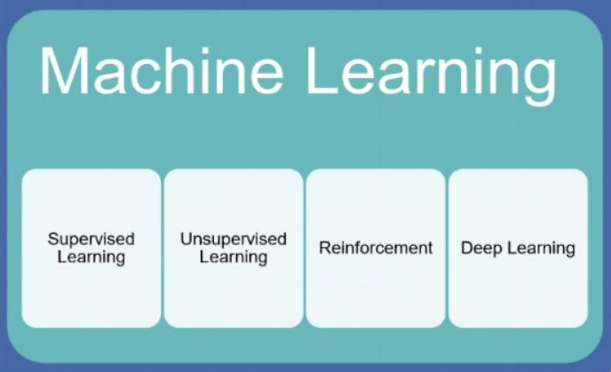

<h1 align="center"> Clúster Jerárquico </h1>
<h2 align="center"> Aprendizaje No Supervisado<h2>

# Introducción 

La IA es impulsada por el aprendizaje automático y aprendizaje profundo

¿Qué es el aprendizaje automático? Es un subconjunto de algoritmos de Inteligencia Artificial que entrena a las máquinas (computadoras) para aprender. Este aprendizaje se logra mediante la extracción de patrones de conjuntos de datos.
El éxito de este aprendizaje se debe al  concepto central del aprendizaje automático: una máquina (algoritmo) puede aprender de ejemplos y la experiencia.
Dentro del aprendizaje automático nos encontramos con diferentes tipos de aprendizajes.

  

En esta ocasión trabajé con el aprendizaje no supervisado, con las métricas de distancia las cuales permiten identificar objetos que comparten características similares y no similares, en específicico con el cluster jerárquico. 
El análisis de clúster consiste en la segmentación y delimitación de grupos de objetos (elementos), que son unidos por características comunes que éstos comparten.

# Datos
**Objetivo.** Obtener clústeres de casos de usuarios, con características similares, evaluados para la adquisición de una casa a través de un crédito hipotecario con tasa fija a 30 años.

**Fuente de datos:**

* ingresos: son ingresos mensuales de 1 o 2 personas, si están casados.
* gastos_comunes: son gastos mensuales de 1 o 2 personas, si están casados. 
* pago_coche
* gastos_otros
* ahorros
* vivienda: valor de la vivienda.
* estado_civil: 0-soltero, 1-casado, 2-divorciado
* hijos: cantidad de hijos menores (no trabajan).
* trabajo: 0-sin trabajo, 1-autonomo, 2-asalariado, 3-empresario, 4-autonomos, 5-asalariados, 6-autonomo y asalariado, 7-empresario y autonomo, 8-empresarios o empresario y autónomo 
* comprar: 0-alquilar, 1-comprar casa a través de crédito hipotecario con tasa fija a 30 años.

## Conclusión 

La aplicación del algoritmo jerárquico ascendente y siguiendo los pasos necesarios para formar clúster,me permitió clasificar las variables, en este caso para analizar que grupo es más adecuado para solicitar un préstamo.

Con el análisis se definieron los siguientes clúster, con lo que pude concluir que:

**Clúster 0:** Conformado por 30 casos de una evaluación hipotecaría, con un ingreso promedio mensual de 3421 USD, con gastos comunes de 846 USD, otros gastos de 527 USD y un pago mensual de coche de 309 USD. Estos gastos en promedio representan casi la mitad del salario mensual (1682 USD). Por otro lado, este grupo de usuarios tienen un ahorro promedio de 24289 USD, y un valor promedio de vivienda (a comprar o hipotecar) de 295590 USD. Además, en su mayoría son solteros (0-soltero), sin hijos menores y tienen un tipo de trabajo asalariado (2-asalariado).

**Clúster 1:** Conformado por 51 casos de una evaluación hipotecaría, con un
ingreso promedio mensual de 6394 USD, con gastos comunes de 1021 USD,
otros gastos de 533 USD y un pago mensual de coche de 192 USD. Estos gastos
en promedio representan casi la cuarta parte del salario mensual (1746 USD). Por
otro lado, este grupo de usuarios tienen un ahorro promedio de 54382 USD, y un
valor promedio de vivienda (a comprar o hipotecar) de 421178 USD. Además, en
su mayoría son casados (1-casados), con 2 hijos menores y tienen un tipo de
trabajo autónomo y asalariado (6-autonomo y asalariado).

**Clúster 2:** Conformado por 35 casos de una evaluación hipotecaría, con un
ingreso promedio mensual de 6599 USD, con gastos comunes de 1087 USD,
otros gastos de 362 USD y un pago mensual de coche de 204 USD. Estos gastos
en promedio representan poco más de la cuarta parte del salario mensual (1653
USD). Por otro lado, este grupo de usuarios tienen un ahorro promedio de 51863
USD, y un valor promedio de vivienda (a comprar o hipotecar) de 515494 USD.
Además, en su mayoría son solteros (0-solteros), sin hijos menores y tienen un
tipo de trabajo asalariado (2-asalariado).

**Clúster 3:** Conformado por 48 casos de una evaluación hipotecaría, con un
ingreso promedio mensual de 3189 USD, con gastos comunes de 785 USD, otros
gastos de 548 USD y un pago mensual de coche de 243 USD. Estos gastos en
promedio representan casi la mitad del salario mensual (1576 USD). Por otro lado,
este grupo de usuarios tienen un ahorro promedio de 23616 USD, y un valor
promedio de vivienda (a comprar o hipotecar) de 277066 USD. Además, en su
mayoría son casados (1-casados), con 1 hijo menores y tienen un tipo de trabajo
autónomo y asalariado (6-autonomo y asalariado).

**Clúster 4:** Conformado por 20 casos de una evaluación hipotecaría, con un
ingreso promedio mensual de 4843 USD, con gastos comunes de 1009 USD,
otros gastos de 572 USD y un pago mensual de coche de 122 USD. Estos gastos
en promedio representan poco más de la tercera parte del salario mensual (1703
USD). Por otro lado, este grupo de usuarios tienen un ahorro promedio de 36340
USD, y un valor promedio de vivienda (a comprar o hipotecar) de 337164 USD.
Además, en su mayoría son solteros (0-solteros), sin hijos menores y tienen un
tipo de trabajo autónomo (1-autonomo).

**Clúster 5:** Conformado por 12 casos de una evaluación hipotecaría, con un
ingreso promedio mensual de 4466 USD, con gastos comunes de 1315 USD,
otros gastos de 502 USD y un pago mensual de coche de 114 USD. Estos gastos
en promedio representan casi la mitad del salario mensual (1931 USD). Por otro
lado, este grupo de usuarios tienen un ahorro promedio de 23276 USD, y un valor
promedio de vivienda (a comprar o hipotecar) de 269429 USD. Además, en su
mayoría son casados (1-casados), con 2 hijos menores y tienen un tipo de trabajo
autónomo y asalariado (6-autonomo y asalariado).

**Clúster 6:** Es un segmento de clientes conformado por solo 6 usuarios, con un ingreso promedio mensual de 6404 USD, con gastos comunes de 1176 USD, otros gastos de 769 USD y un pago mensual de coche de 168 USD. Estos gastos en promedio representan casi una tercera parte del salario mensual (2113 USD). Por otro lado, este grupo de usuarios tienen un ahorro promedio de 61715 USD, y un valor promedio de vivienda (a comprar o hipotecar) de 625138 USD. Además, todos son solteros (0-soltero), sin hijos y tienen un tipo de trabajo en su mayoría autónomos (1-autónomo).
